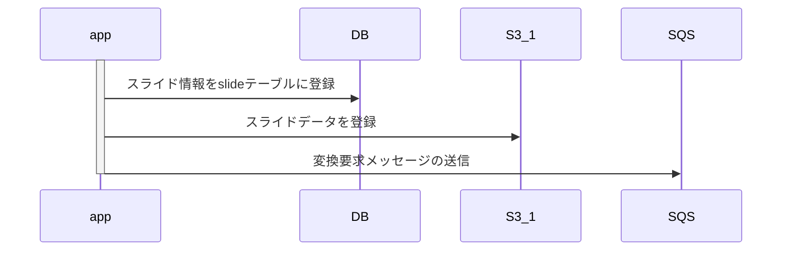
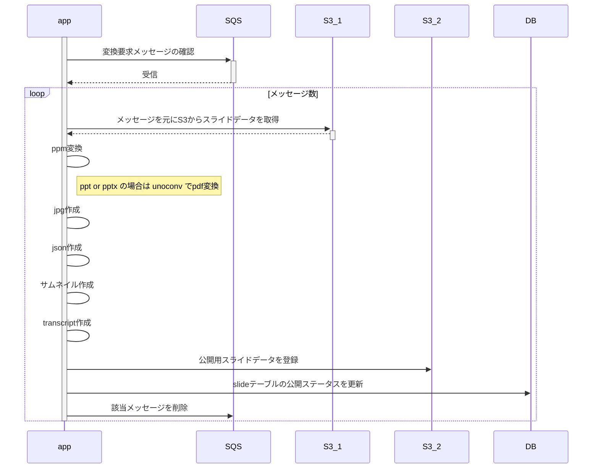

# 設計

## スライド変換方法について

### スライドアップロード


### スライド変換


###機能概要
* sqsメッセージ取得: aws api
* pdf変換: unconv
* ppm変換: pdftoppm
* jpg生成: 各スライドを画像に変換。mogrifyコマンドを使用
* json生成: 各スライドの画像ファイル名を管理 ["スライド1の画像", "スライド2の画像", ..., "スライドnの画像"]。なぜかjson形式ではない
* transcript生成: pdftotext
* slideテーブルの公開ステータス更新: published = 1
* 該当メッセージの削除: aws api removeMessage()

### クラス図
@import "images/models.png"

### データ設計

#### DB
##### テーブル定義
|DB|description|
|---|---|
|||
##### ER図

@import "images/slidehub_er.svg"

#### messsage

|parameter|description|
|---|---|
|id| スライドID。スライド発行時にDB上で管理している最新のidをインクリメントしたものを設定する。|
|object_key| s3の発行時に自動生成される|

##### サンプル
```sh
{"id":1, "object_key":"1d5837d3cbdagaehfe2gaead629a624d"}
{"id":2, "object_key":"1d5837d3cbdgdagaergarhagefawarve"}
{"id":3, "object_key":"1d5b3grag34qwgbaereawgqra3239624"}
```


### Todo
* [ ] sqsメッセージ操作
  * [ ] msg送信機能
  * [ ] msg受信機能
  * [ ] msg削除機能
* [ ] スライド作成
  * [ ] pdf変換機能
  * [ ] ppm 変換機能
  * [ ] jpg生成機能
  * [ ] transcript生成機能
* [ ] db操作
  * [ ] dbデータ取得
  * [ ] dbデータ更新
* [ ] s3操作
  * [ ] s3ダウンロード
  * [ ] s3アップロード


### tips

#### 各種変換ロジックについて
作者のブログに各種変換ロジックについての詳細の記載がある。
http://www.ryuzee.com/contents/blog/7028

##### ppt -> pdf変換

Xvfb


#### golang sqsの操作について
`ReceiveMessage`の返却値`sqs.Message`の内部データはそのままでは扱えない。
body部がjsonの場合など、json変換などが必要となる。


#### proxy設定
動作環境がproxy配下に存在する場合は、環境変数`http_proxy`の設定が必要
* windowsの場合
```
set http_proxy=web-proxy.jp.hpecorp.net:8080
set https_proxy=web-proxy.jp.hpecorp.net:8080
```
* linux,macの場合
```
export http_proxy=web-proxy.jp.hpecorp.net:8080
export https_proxy=web-proxy.jp.hpecorp.net:8080
```
