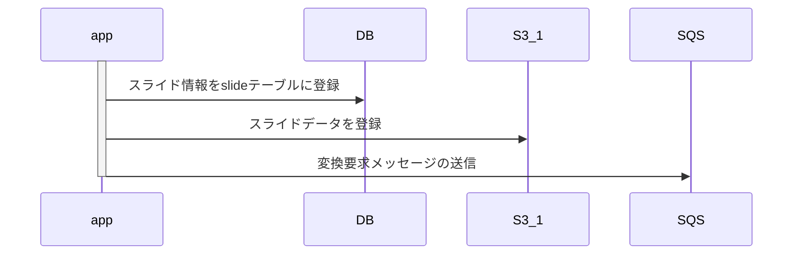
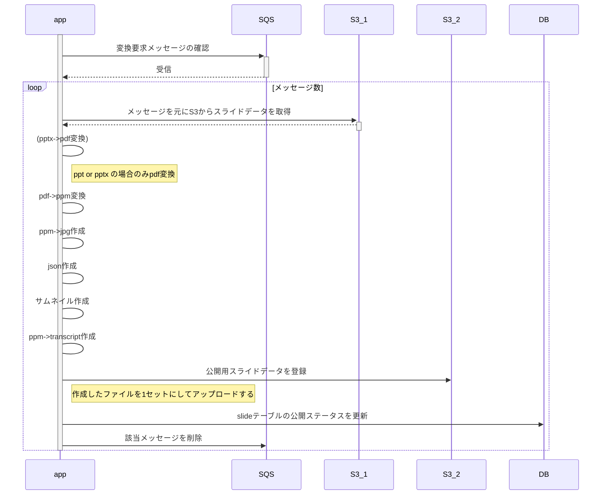

スライド変換処理 設計


## スライド変換方法について


### スライドアップロード




### スライド変換




### 機能概要

* sqsメッセージ取得: aws api
* pdf変換: xpdf, unoconv
* ppm変換: pdftoppm(画像を綺麗にするため) `yum -y install ImageMagick`
* jpg生成: 各スライドを画像に変換。mogrifyコマンドを使用
* json生成: 各スライドの画像ファイル名を管理 ["スライド1の画像", "スライド2の画像", ..., "スライドnの画像"]。なぜかjson形式ではない
* transcript生成: pdftotext
* slideテーブルを更新
 * 変換ステータスを更新(converted)
 * 拡張子を登録(extension)
 * スライド枚数を登録(num_of_pages)
* 該当メッセージの削除: aws api removeMessage()
* sqsメッセージ削除: aws api

### クラス図

  

### データ設計


#### DB


##### テーブル定義


|DB|description|
|---|---|
|||

##### ER図


  

#### messsage


|parameter|description|
|---|---|
|id| スライドID。スライド発行時にDB上で管理している最新のidをインクリメントしたものを設定する。(DBのindexか？)|
|object_key| スライドファイルの管理Key。s3での管理上のファイル名として利用しており、スライドアップロード時にランダムパターンで自動生成される（key重複はない？）|

##### サンプル

```sh
{"id":1, "object_key":"1d5837d3cbdagaehfe2gaead629a624d"}
{"id":2, "object_key":"1d5837d3cbdgdagaergarhagefawarve"}
{"id":3, "object_key":"1d5b3grag34qwgbaereawgqra3239624"}
```

### Todo


#### 個別機能確認


* [x] sqsメッセージ操作
  * [x] msg送信機能
  * [x] msg受信機能
  * [x] msg削除機能
* [ ] スライド作成
  * [x] pdf変換機能
  * [x] ppm変換機能
  * [x] jpg生成機能
  * [ ] json生成機能  
  * [ ] thumbnail生成機能    
  * [ ] transcript生成機能
* [ ] db操作
  * [ ] dbデータ取得
  * [ ] dbデータ更新
* [ ] s3操作
  * [x] s3ダウンロード
  * [ ] s3アップロード


### tips


#### 各種変換ロジックについて

作者のブログに各種変換ロジックについての詳細の記載がある。
http://www.ryuzee.com/contents/blog/7028

##### ppt -> pdf変換

openofficのpdf変換機能を利用して変換する。
これには、以下のツールを利用する。

* file : file種別の判別に利用する
 ```sh
 yum -y install file
 ```

* unoconv : office製ファイルのパース・変換処理をするツール
 ```sh
 yum -y install unoconv
 ```

* OpenOffice : 日本語版をインストール
 ```sh
 wget "https://sourceforge.net/projects/openofficeorg.mirror/files/4.1.5/binaries/ja/Apache_OpenOffice_4.1.5_Linux_x86-64_install-rpm_ja.tar.gz"
 ```

* Xvfb : 仮想バッファフレーム（openoficeのGUI機能を代替するために必要）
 ```sh
 yum -y install xorg-x11-server-Xvfb
 ```

* font : 日本語PDFに変換する場合は、フリーの日本語フォントのインストールが必要
 ```sh
 yum install ipa-gothic-fonts ipa-pgothic-fonts
 ```

* 変換処理
 ```sh
 export DISPLAY=:1.0
 Xvfb :1 &
 file file名 |awk
 unoconv --listener &
 file --mime-type file名
 unoconv -f pdf file名
 ```

##### pdf -> ppm変換

pdfを画像変換するときの画質が悪いので、一旦ppmに変換する。
`xpdf`の`pdftoppm`コマンドを利用

* install
```
yum -y install epel-release
yum -y install xpdf
```

* 変換処理
```
pdftoppm #{file} slide
```

##### ppm -> jpg変換

```
mogrify -format jpg slide*.ppm
```

##### jpg -> thumbnail変換
* 先頭ページを通常細部のthumbnailとして保管
* 全てのページを小さいサイズのthumbnailとして保管

##### pdf -> transcript生成
* ページ毎のpdf内の文字列を抽出する


#### golang sqsの操作について

`ReceiveMessage`の返却値`sqs.Message`の内部データはそのままでは扱えない。
body部がjsonの場合など、json変換などが必要となる。


#### proxy設定

動作環境がproxy配下に存在する場合は、環境変数`http_proxy`の設定が必要
* windowsの場合
```
set http_proxy=
set https_proxy=
```

* linux,macの場合
```
export http_proxy=
export https_proxy=
```
